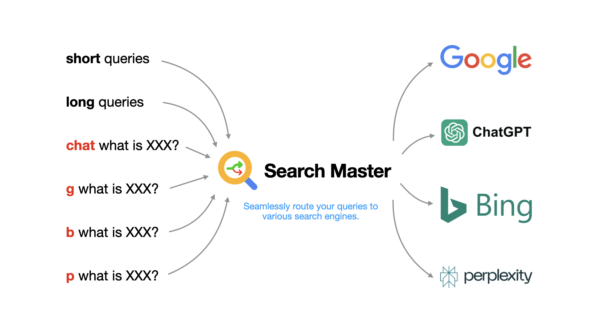
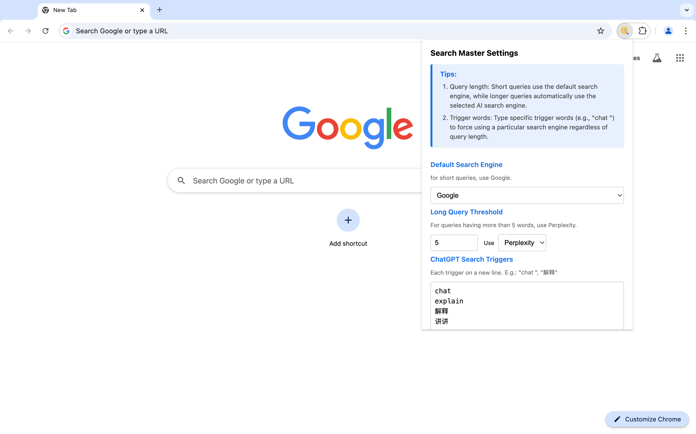

# Search Master


A Chrome extension that intelligently routes your searches between multiple search engines (Google, Bing, ChatGPT, Perplexity) based on your preferences, making web searches more efficient.

## Features

- **Multi-Engine Support**: Choose between multiple search engines including Google, Bing, ChatGPT, and Perplexity
- **Smart Routing**: Automatically directs queries to traditional or AI search engines based on query length
- **Customizable Triggers**: Set your own trigger keywords for each search engine
- **Default Search Engine**: Select your preferred default search engine for short queries
- **Multi-Language Support**: Properly handles queries in various languages, including Chinese, Japanese, and Korean (CJK)
- **Auto-Save Settings**: Settings are automatically saved as you type
- **Privacy-Focused**: No data collection or tracking - all processing happens locally

## Demo


You can also watch our [demo video](https://www.youtube.com/watch?v=5U-27zr90BQ) to see Search Master in action.

## Installation

You can install Search Master in two ways:

### Option 1: Chrome Web Store (Recommended)

1. Visit the [Search Master page](https://chromewebstore.google.com/detail/search-master/afdjfknkcnildioigkobmbjakfnggolp) on the Chrome Web Store
2. Click "Add to Chrome" to install the extension
3. The extension will be automatically installed and ready to use

### Option 2: Manual Installation

For developers or users who want to install from source:

1. Go to the [Releases](https://github.com/irgb/search-master/tags) page
2. Download the source code (zip) from the latest release
3. Extract the zip file to a folder on your computer
4. Open Chrome and go to `chrome://extensions/`
5. Enable "Developer mode" by toggling the switch in the top right corner
6. Click "Load unpacked" and select the folder where you extracted the zip file

## Usage

Search Master provides two ways to choose your search engine:

1. **Query Length Based Selection**:
   - Short queries use your default search engine (Google or Bing)
   - Longer queries automatically use your selected AI search engine (ChatGPT or Perplexity)
   - The default threshold is 10 words - queries longer than this will use the AI search engine
   - You can customize this threshold in the settings

2. **Trigger Word Based Selection**:
   - Type specific trigger words (e.g., "chat ", "b ", "p ") to force using a particular search engine
   - Each trigger should be on a new line in the settings

### Default Triggers

ChatGPT triggers:
```
chat 
讲讲
解释
```

Perplexity triggers:
```
p 
pplx 
```

Google triggers:
```
g 
搜索
```

Bing triggers:
```
b 
```

Note: 
- Some triggers (like "chat ") include a space at the end, which is important for English queries
- Chinese triggers typically don't need spaces
- Settings are automatically saved as you type
- Word count for non-English languages (like Chinese) is handled properly - each character is counted as a word
- Queries from search engine homepages or with spell corrections will stay on that search engine

## Privacy

- All data processing happens locally in your browser
- No user data is collected or stored except for your preferences
- No analytics or tracking

## Support

If you encounter any issues or have suggestions, please [open an issue](https://github.com/irgb/search-master/issues) on GitHub.

## License

This project is licensed under the MIT License - see the LICENSE file for details.
